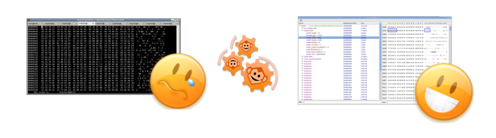
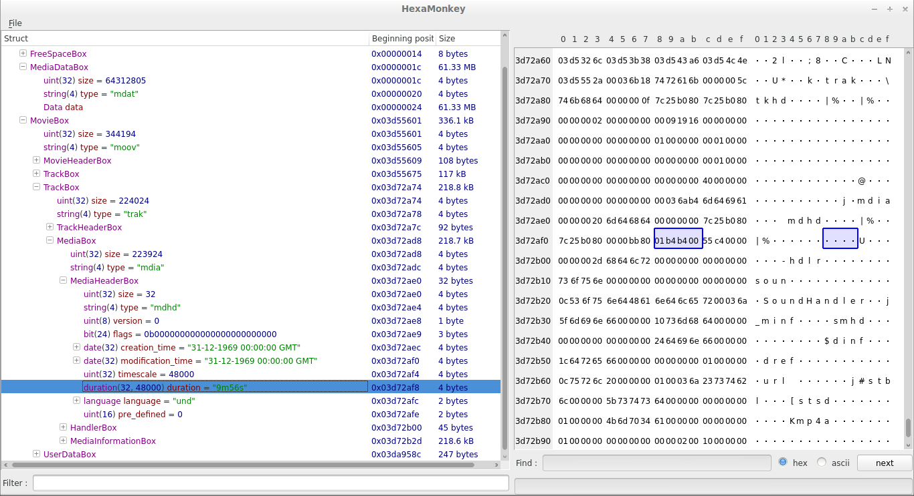

title: Hexamonkey
class: title
authors: Martin Bonnin, Sevan Drapeau-Martin
website: hexamonkey.com

Paris Hackers #10

May, 21st 2014

<contact/>
---
title: Présentation

* projet étudiant à l'Ecole Centrale
* 2 ans de développement
* 4 étudiants
* C++11, QT5, flex/bison
* <a href="https://github.com/hexamonkey/hexamonkey">https://github.com/hexamonkey/hexamonkey
</a>

---
title: What is it for ?

* developer tool made by developers for developers
* a bit like ffmpeg but for analyzing data
* takes any file format description and outputs a hierarchical graphical description
* for an example, video files, game save data, elf files, complete filesystems, ...
* it is <b>not</b> for Mme Michu !

---
title: Other tools

* wireshark for network captures
* ASF viewer is very limited to ASF
* ASN1 compilers are not very user friendly and cannot describe arbitrary data
* there are a couple of good commercial MPEG2-TS analyzers but they are limited to TS (and not free)
* we are in 2014 and I am still using hexedit far too much !
---
title: In practice

---
title: Status

* Supported file formats
	* mpeg4
	* mpeg2-ts
	* matrovska
	* avi
	* asf/wmw
	* png
	* jpeg
	* gif
	* zip
	* sqlite
---
title: How it works

* new langage for describing data structures: <a href="http://hexamonkey.com/hmdoc.php">HMScript</a>
* <b>core</b>: the core module compiles hmscript into an internal representation
* <b>frontend</b>: the frontend module displays the internal representations
* steps:
	1. official specification, e.g. <a href="res/qtff.pdf">qtff.pdf</a>
	2. hmscript, e.g. <a href="https://github.com/HexaMonkey/hexamonkey/blob/master/scripts/mp4.hm">mp4.hm</a>
	3. graphical output, e.g. <a href="res/screenshot.png">hexamonkey</a>
---
title: Demo

---
title: <Merci!>
class: thanks

<contact/>

* questions/suggestions ?

